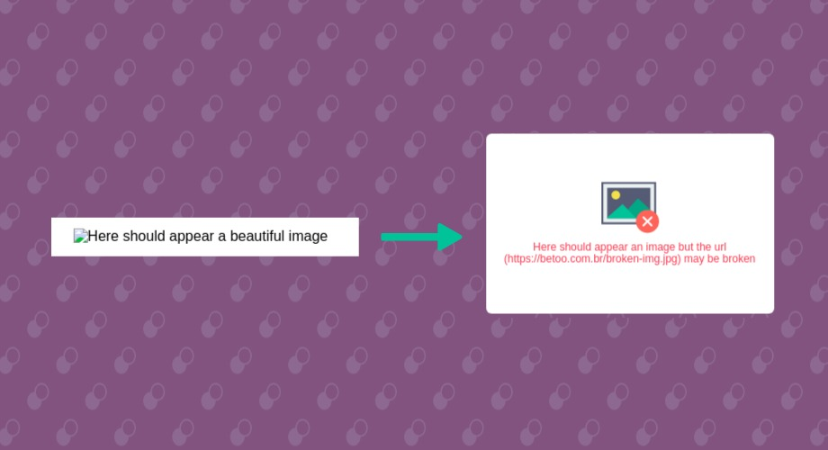

Você já se perguntou como substituir o ícone e texto padrão que aparece quando uma imagem está quebrada no seu site?

Por estar tão acostumado com aquele ícone e o texto alt sendo impresso, até recentemente (04 meses atrás) eu nem imaginava que isso era possível. Apesar de já saber usar pseudoelementos em css, não me passava pela cabeça utilizá-los para dar uma **novo estilo para as imagens com links quebrados.**

Recentemente passei por uma necessidade de construir um previsualizador de imagem para upload que seria integrado há um plugin existente do WordPress. Pensei como poderia evitar o máximo o uso de js para fazer injeção de elemento html dinâmicamente para evitar conflito com o JavaScript do core do plugin, e ao invés disso, pudesse no máximo usar JS para setar o atributo _src_ à medida que a imagem fosse carregada.

Acontece que deixando a tag `` com o src vazio, o tal ícone padrão com o alt que eu havia definido deixava o aspecto final longe do visual que eu havia feito pro upload.



Lembrando de alguns artigos que havia lido há uns tempos quando estava aprendendo sobre **pseudoelementos**, resolvi fazer uma outra pesquisa e tentar deixar um visual legal com um ícone e fonte da minha escolha que se adaptasse à UI que estava criando.

Em linhas práticas o que precisei utilizar para conseguir tal efeito foram o :before e :after e a propriedade content, com um texto customizado dentro do atributo content.

Depois desse caso de previsualizador, fiz um exemplo para selecionar todas as imagens quebradas com JavaScript e adicionar uma classe com os estilos que eu havia criado: adicionando um ícone, criando um texto customizado e de quebra imprimindo o link que estava quebrado.

Fora o uso do atributo :before e :after, junto com a propriedade content, o resto é o básico feijão com arroz do CSS, que vamos ver a seguir.

## Como estilizar as imagens quebradas?

Eu criei uma classe com estilos para ficar neste formato retangular, com espaço suficiente para adicionar um texto e também um ícone ou até mesmo uma imagem de placeholder quando a imagem estivesse quebrada.

```css
.is-broken {
  position: relative;
  width: 280px;
  height: 160px;
  display: block;
  padding: 20px;
}
```

Agora utilizando os poderes das pseudoelementos, podemos estilizar o _:before_ para ficar com o mesmo tamanhos do box que criamos.

Para conseguir tal efeito primeiro vamos adicionar posição absoluta na pseudoclasse.

```css
.is-broken:before {
  /* vamos adicionar um ícone posteriormente
    * utilizando a propriedade content. 
    * Por enquantos deixamos vazio para inicializar
    * o pseudo elemento
     */
  content: '';
  position: absolute;
  top: 0;
  right: 0;
  bottom: 0;
  left: 0;
}
```

Isso é o que preciamos para fazer com que o pseudoelemento seja inicializado, e a partir daí começamos a estilá-lo.

A partir daqui vamos o passo a passo descreve a adição de ícones, espaçamento e cores e também o texto customizado que vai imprimir o link dentro do _src_.

### #1 Adicionar background para sobrepor texto do alt="" que é imprimido automaticamente

```css
.is-broken:before {
  content: '';
  position: absolute;
  top: 0;
  right: 0;
  bottom: 0;
  left: 0;
  /* cor de background */
  background-color: #fff;
}
```

### #2 Modificar o _content_ para adicionar mensagem desejada

A propriedade _content_ nos permite adicionar tanto um texto qualquer como imprimir algum atributo do elemento, como o _alt_ e _src_ da imagem.

Vamos imprimir o _src_ para identificar mais fácil a qual link está quebrado.

Essa é a syntaxe que precisamos para conseguir tal efeito.

```css
.is-broken:before {
  content: attr(src); /* « imprimindo o src como texto */
  position: absolute;
  top: 0;
  right: 0;
  bottom: 0;
  left: 0;
  /* cor de background */
  background-color: #fff;
}
```

Podemos também adicionar um texto junto com a URL que vamos imprimir.

Para melhorar ainda mais a estética, vamos imprimir a url dentro de parênteses.

Aqui como ficará nosso código.

```css
.is-broken:before {
  /* ↓ texto + src ↓ */
  content: 'Este link parece estar quebrado (' attr(src) ')';
  position: absolute;
  top: 0;
  right: 0;
  bottom: 0;
  left: 0;
  /* cor de background */
  background-color: #fff;
}
```

### #3 Adicionar ícone ou imagem de background para decorar nossa mensagem de erro

Nessa etapa fica a seu gosto experimentar como decorar a mensagem de erro que vamos imprimir.

Eu decidi adicionar um ícone representando uma imagem com erro utilizando as propriedades background-image, background-position e background-size.

Pode-se utilizar o _shorthand_ background se desejar :)

```css
.is-broken:before {
  /* ↓ texto + src ↓ */
  content: 'Este link parece estar quebrado (' attr(src) ')';
  position: absolute;
  top: 0;
  right: 0;
  bottom: 0;
  left: 0;
  /* cor de background */
  background-color: #fff;

  /* Posição e tamanho do ícone no meu exemplo */
  background-position: center 50px;
  background-repeat: no-repeat; /* Só quero ver um icone :) */
  background-size: 64px;

  /* Ícone que escolhi (em base64)*/
  background-image: url(data:image/svg+xml;utf8;base64..);
  /* Cortei a url neste exemplo por estar utilizando uma base64 */
}
```

Por fim, adicionei esse **JavaScript** básico que seleciona todas as imagens que estão quebradas e adicionaa a classe com estilos que criei.

```javascript
//DOMContentLoaded
/* ... */

document.querySelectorAll('img').forEach(function(img, ind) {
  img.onerror = function() {
    this.classList.add('is-broken');
  };
});
```

### Conclusão: por que não fazer?

Depois de ter criado esse exemplo não consigo mais ver um site com imagem quebrada sem estar estilizado. Afinal, é um simples código CSS que muda bastante a percepção do usuário no seu site.
